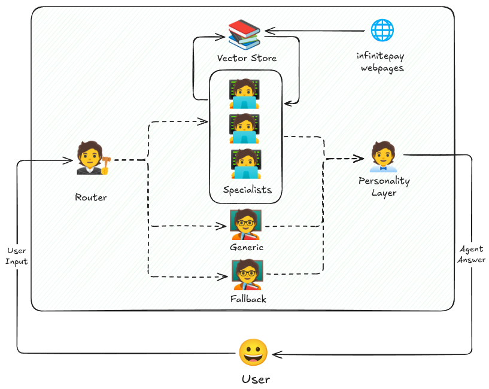
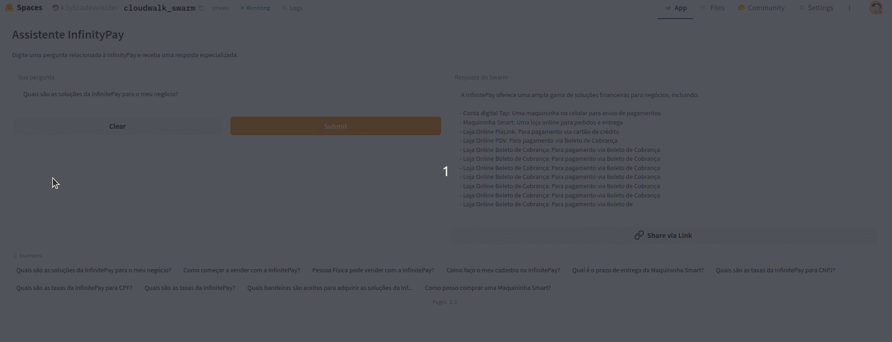

# CloudWalk Agent Swarm 🐝
## Description
 

In this framework, expert agents can be created dynamically using a dictionary containing ``{AGENT_NAME: SPECIALTY}`` (see ``build_specialist_agents`` in ``agents.py``) at agent creation time. Furthermore, there is a fallback function in case the agent responsible for selecting the expert fails, directing the agent to the fallback agent as a backup plan. After directing the question to the agent, it will generate the response, which will be forwarded to the personality layer before being sent to the user.

Expert agents consult a FAISS vector store composed of a set of pages (see ``URL_LIST`` in ``config.yml``). This vector store is created at each initialization (``REBUILD_VECTOR_STORE=True``, by default) within a few moments, containing the most recent information. However, to use static content, simply change ``REBUILD_VECTOR_STORE=False`` in ``config.yml``. For each input, k documents are retrieved from the vector store and used as context for that input. The agent then uses this information to respond to the user's input.

The following agents were defined:
- **ROUTER**: Receives the customer's message (input) and directs it to the most appropriate agent.
- **GENERIC**: Generic agent for InfinityPay.
- **MAQUININHA**: Specialist in POS terminals.
- **ONLINE_COBRANCA**: Specialist in online billing.
- **PDV_ECOMMERCE**: Specialist in POS and ecommerce.
- **CONTA_DIGITAL**: Specialist in digital accounts, Pix, boleto, cards, etc.
- **Fallback**: Generalist agent, in case the ROUTER fails to direct to other agents.

The following subsections describe how to use the application, how to access it, and the initial parameters of the application.

## How to use:
- Clone this repository into your local development environment.
- Install ``uv`` with pip: ``pip install uv``
- Create a .env file with the environment variables ``HF_TOKEN`` and ``SERPAPI_API_KEY``.
- Create your virtual environment with the ``uv venv .venv``.
- Initialize your virtual environment:
  - Linux/macOS: ``source .venv/bin/activate``
  - Windows (cmd.exe): ``.venv\Scripts\activate``
  - Windows (PowerShell): ``.venv\Scripts\Activate.ps1``
- Install the required libraries with ``uv pip install -r requirements.txt``.

### Gradio
- Run the app locally with ``python3 app-gradio.py``.

### HuggingFace Spaces
- Acess the deployd version on Huggingface Spaces: https://huggingface.co/spaces/k3ybladewielder/cloudwalk_swarm (WIP)
 

### API:
- Initialize the API using the ``uvicorn api:app --reload`` command in the terminal.
- There's an interactive interface (Swagger UI) where you can submit questions to the POST /ask route. Example of input JSON:

```json
{
  "question": "Como posso receber pagamentos com maquininha?"
  "user": "user_123"
}

```
the answer will be a JSON with the agent and answer:

```json
{
  "response": personality_response,
  "source_agent_response": raw_response,
  "agent_workflow": [
    {
      "agent_name": "MAQUININHA",
      "tool_calls": {
        "MAQUININHA": "Você pode usar a maquininha com Wi-Fi ou chip..."
      }
    }
  ]
}

```

- To acess via postman, send an HTTP ``POST``request to ``http://127.0.0.1:8000/ask`` with the following body:

```json
{
  "question": "Quais são os benefícios da conta digital?",
  "user_id": "usuario_123"
}
```

- To ask via terminal (curl), execute the command:

```bash
curl -X POST http://127.0.0.1:8000/ask \
-H "Content-Type: application/json" \
-d '{"message": "Quero saber sobre maquininhas", "user_id": "usuario_123"}'
```

### Docker
- build the image executing the command ``docker-compose build``, then inicialize the API with ``docker-compose up``. The API will be available on ``http://localhost:8000/``;
- To watch the logs in real time, use the command ``docker-compose logs -f``;
- To stop the container, use ``docker-compose down``.

## Params
- LLM: Default model used is ``"Qwen/Qwen3-0.6B"``, to change the model, just change the ```LLM_MODEL``` parameter in the ```config.yaml``` file.
- Vector Store: The parameter ``REBUILD_VECTOR_STORE`` to build the vector stores that is the knowledge base is set ``True`` by default, That is, every time the application is deployed or started locally, the process of creating and storing the vector store will be executed. To learn more, check the ``functions.py`` file.
- Other parameters related to vector store such as sites that serve as source (``URL_LIST``), ``CHUNK_SIZE`` and ``CHUNK_OVERLAP`` can be checked in the ``config.yaml`` file.

## How to Contribute
If you want to contribute to this project with improvements or suggestions, feel free to open a pull request.  
